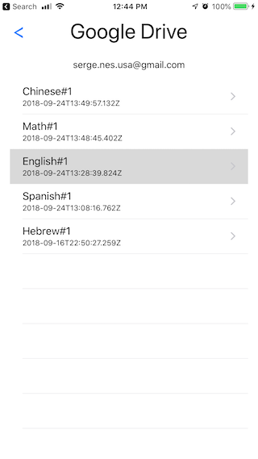
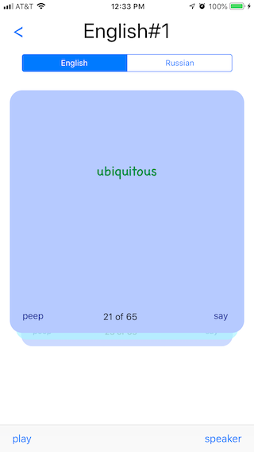
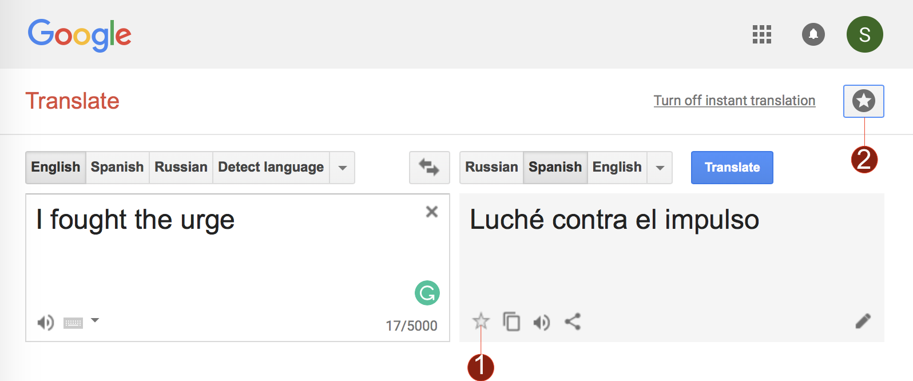
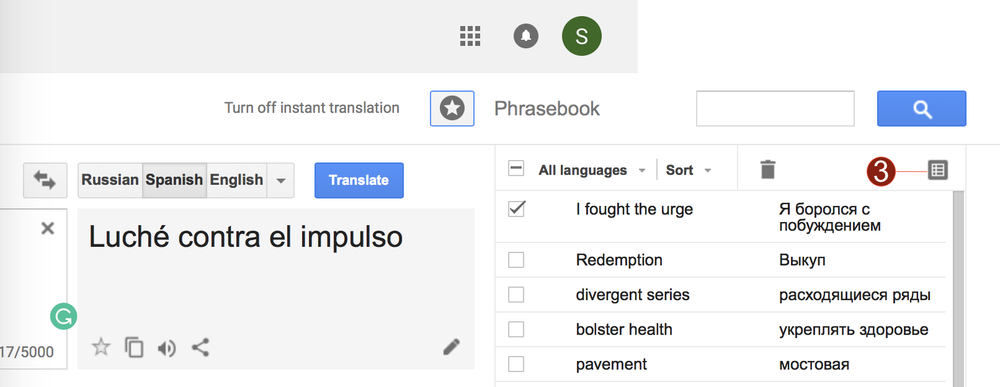

# RecalList-iOS
This app turns the favorites items saved in google translate website to the memory cards.

List of documents          |  Cards
:-------------------------:|:-------------------------:
  	   |  

# Prepare the lists
1. Go to the Google Translate site (https://translate.google.com).
2. Use a "save" button #1 every time you've got a translation and you feel that you want to remember this couple of the words or the phrases. 
3. Use a "Show Phrasebook" button #2 and "Export to Google Sheets" button #3 to save all the words and the phrases on your Google Drive.

Translate web1             |  Translate web2 
:-------------------------:|:-------------------------:
  	   |  

# To run the app
You need to enable Drive API and Spreadsheet API in Google developer console and to get your own CLIENT_ID for this app. Place it in project in file Secrets.swift.
```groovy
struct Secrets {
    static let CLIENT_ID = "XXX.apps.googleusercontent.com"
}
```
And then you need to define a new URL scheme on Info tab in XCode, use the same CLIENT_ID of Google API.
```groovy
com.googleusercontent.apps.XXX
```

Contact
=================================
Try to contact me if you have any questions at serge.nes @ gmail.com


MIT License
=================================
Copyright (c) 2018 Sergey Nes

Permission is hereby granted, free of charge, to any person obtaining a copy
of this software and associated documentation files (the "Software"), to deal
in the Software without restriction, including without limitation the rights
to use, copy, modify, merge, publish, distribute, sublicense, and/or sell
copies of the Software, and to permit persons to whom the Software is
furnished to do so, subject to the following conditions:

The above copyright notice and this permission notice shall be included in all
copies or substantial portions of the Software.

THE SOFTWARE IS PROVIDED "AS IS", WITHOUT WARRANTY OF ANY KIND, EXPRESS OR
IMPLIED, INCLUDING BUT NOT LIMITED TO THE WARRANTIES OF MERCHANTABILITY,
FITNESS FOR A PARTICULAR PURPOSE AND NONINFRINGEMENT. IN NO EVENT SHALL THE
AUTHORS OR COPYRIGHT HOLDERS BE LIABLE FOR ANY CLAIM, DAMAGES OR OTHER
LIABILITY, WHETHER IN AN ACTION OF CONTRACT, TORT OR OTHERWISE, ARISING FROM,
OUT OF OR IN CONNECTION WITH THE SOFTWARE OR THE USE OR OTHER DEALINGS IN THE
SOFTWARE.